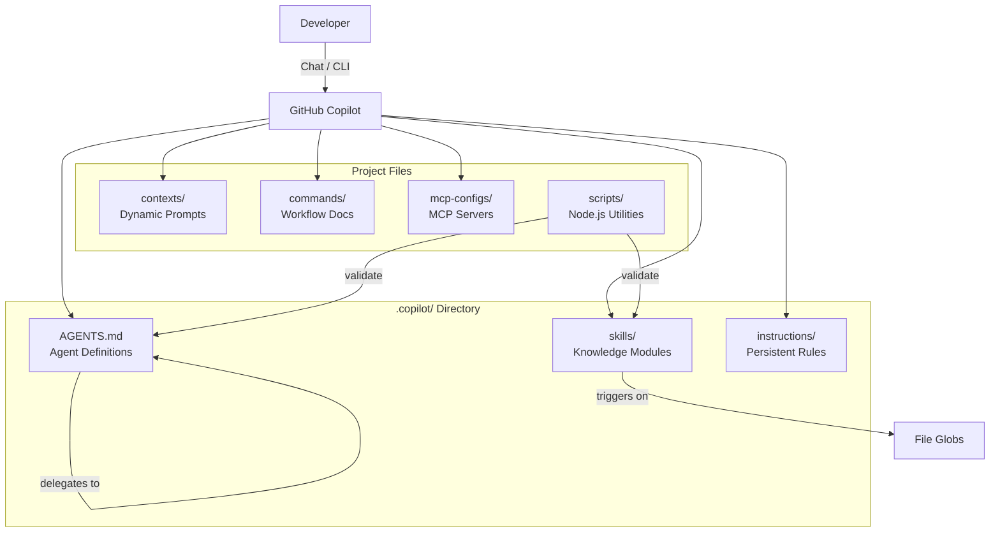
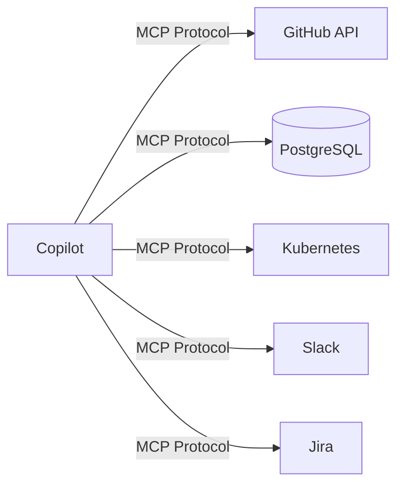

# Architecture

System design and component relationships for Everything Copilot.

## Design Philosophy

Everything Copilot is built on four principles:

1. **Convention over configuration.** Drop `.copilot/` into a project and it works. No settings files, no extension configuration, no build step.
2. **Separation of concerns.** Agents define behavior. Skills provide knowledge. Instructions set persistent rules. Contexts set ephemeral modes.
3. **Progressive enhancement.** Start with the defaults. Add skills, agents, and MCP integrations as your needs grow.
4. **Verification by default.** Every workflow includes a validation step. Code is not considered done until tests pass and quality checks clear.

## Component Overview



## Agent System

Agents are specialized personas defined in `.copilot/AGENTS.md`. Each agent has:

- **Responsibilities**: What the agent does and does not do.
- **Model recommendation**: Which model (Opus, Sonnet, Haiku) suits the task.
- **Tool access**: Which tools the agent may use (Read, Edit, Bash, Grep, etc.).
- **Workflow**: Step-by-step process the agent follows.
- **Constraints**: Hard rules the agent must not violate.
- **Delegation rules**: When to hand off to another agent.

Agents do not share state directly. Delegation happens through explicit handoff, where one agent's output becomes the next agent's input. This prevents context bleeding and keeps each agent's scope focused.

### Agent Roster

| Agent | Role | Model |
|-------|------|-------|
| Planner | Decompose features into tasks | Sonnet |
| TDD Guide | Red-Green-Refactor implementation | Sonnet |
| Code Reviewer | Quality analysis with severity grading | Sonnet |
| Architect | System design and ADRs | Opus |
| Security Reviewer | Vulnerability detection | Opus |
| Performance Optimizer | Profiling and optimization | Sonnet |
| Refactor & Clean | Dead code removal, DRY fixes | Sonnet |
| Documentation | API docs and guides | Haiku |
| E2E Runner | End-to-end test generation | Sonnet |
| Go Reviewer | Go-specific patterns | Sonnet |
| Continuous Learner | Pattern extraction | Haiku |
| Build Fixer | Build error diagnosis | Sonnet |

## Skill Loading Mechanism

Skills live in `.copilot/skills/<skill-name>/`. Each skill directory contains:

1. **`SKILL.md`** -- Manifest with metadata, trigger conditions, file globs, and a file list.
2. **Supporting files** -- Markdown documents containing the domain knowledge.

Loading is conditional. Skills activate when:
- A file matching the skill's glob patterns is opened or edited.
- The conversation topic matches a trigger condition.
- A command references the skill explicitly.

This keeps the context window lean. Only relevant knowledge is loaded per task.

## Context Management

Context flows through three layers with different lifetimes:

| Layer | Lifetime | Location | Purpose |
|-------|----------|----------|---------|
| Instructions | Always active | `.copilot/instructions/` | Persistent coding standards |
| Skills | Conditional | `.copilot/skills/` | Domain knowledge, loaded by trigger |
| Contexts | Per-task | `contexts/` | Mode switching (dev, review, research) |

Instructions are always in scope. Skills load when relevant. Contexts are set once per task and define the agent's mindset for that session.

## Model Routing

Commands and agents specify which model to use. The routing follows a cost-effectiveness principle:

- **Opus**: Architecture, security audits, cross-system reasoning. High cost, deep thinking.
- **Sonnet**: Implementation, TDD, code review, planning. Balanced cost and capability.
- **Haiku**: Documentation, formatting, quick fixes, pattern extraction. Low cost, fast.

Model selection is a recommendation, not enforcement. The developer can override at any time.

## MCP Integration Architecture

MCP (Model Context Protocol) servers extend Copilot with external tool access. The registry lives in `mcp-configs/mcp-servers.json` and defines:

- **Server entries**: Command, arguments, environment variables, and capabilities.
- **Profiles**: Named groups of servers for different workflows (development, backend, devops, full).



MCP servers run as local processes. Copilot communicates with them over stdio using the MCP protocol. Each server declares its capabilities, and Copilot routes tool calls accordingly.

## Verification Loop Design

Verification is not a separate step -- it is built into every workflow:

1. **Checkpoint evals**: Save a labeled snapshot of the project state. Compare against it later to detect regressions.
2. **Continuous evals**: Run linters, type checkers, and test suites after every code change.
3. **Pass@k metrics**: Measure how often the agent produces correct output on the first try vs. after iteration.
4. **Grading rubrics**: Structured criteria for evaluating output quality (correctness, completeness, style, test coverage).

The `/checkpoint` and `/verify` commands expose this system to the developer. The TDD and build-fix workflows use it internally.

## Directory Layout

```
everything-copilot/
  .copilot/                  # Copilot reads this automatically
    AGENTS.md                # Agent definitions (required)
    skills/                  # Knowledge modules with SKILL.md manifests
    instructions/            # Persistent rules (always loaded)
  agents/                    # Agent documentation (human reference)
  commands/                  # Command workflow documentation
  contexts/                  # Dynamic system prompts (dev, review, research)
  scripts/                   # Node.js utilities (validation, init, skill creator)
  mcp-configs/               # MCP server registry and templates
  examples/                  # Team configs, language setups, workflows
  docs/                      # This documentation
  tests/                     # Test suite for scripts
  .github/                   # GitHub Actions and PR templates
```
